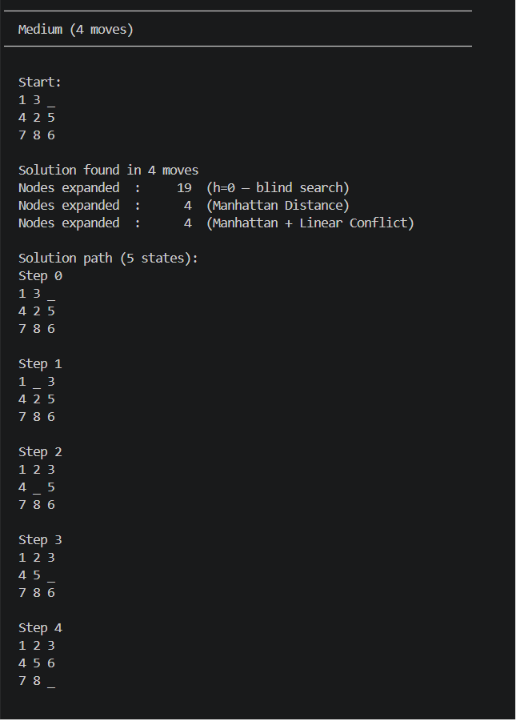
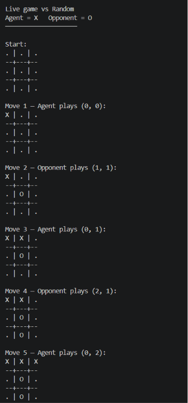

# AI Agents


### Engineering and Evaluating Intelligent Systems Across Probabilistic Reasoning, Search, and Reinforcement Learning

> Exploring how design decisions influence the behaviour, performance, and learning dynamics of intelligent systems.

---

## Overview

This repository explores intelligent agent design across three foundational AI paradigms:

* **Probabilistic Reasoning**
* **Search-Based Decision Making**
* **Reinforcement Learning**

The goal was not to invent new algorithms, but to understand how engineering decisions affect the behaviour of intelligent agents.

Each project investigates a different question:

| Agent               | Engineering Question                                        |
| ------------------- | ----------------------------------------------------------- |
| Intrusion Detection | How does training stability affect probabilistic modelling? |
| Puzzle Solver       | How does heuristic quality affect search efficiency?        |
| Tic-Tac-Toe Agent   | How does representation affect learning performance?        |

Each agent serves as a small experimental platform for evaluating how specific design choices influence intelligent system behaviour.

Every implementation includes:

* Runnable demonstrations
* Experimental evaluation
* Documented design decisions
* Reproducible results

---

## Project Highlights

### Intrusion Detection Agent

* Hidden Markov Model trained using Baum-Welch EM
* Scaled forward-backward computation for numerical stability
* Asymmetric hidden-state initialization
* Correctly flagged all three evaluated attack scenarios
* 12.61-point separation between normal and anomalous behaviour

### Puzzle Solver Agent

* A* Search with Manhattan Distance and Linear Conflict heuristics
* Benchmarking of heuristic quality on 8-puzzle instances
* 74× reduction in node expansions on hard puzzle instances
* Demonstrates the impact of heuristic design on search efficiency

### Tic-Tac-Toe Agent

* Q-Learning with linear function approximation
* 16-feature state-action representation
* Competitive policy learned using only 61 weights
* 75% win rate against random opponents
* Demonstrates the impact of representation on learning performance

---

## Agent Portfolio

| Paradigm               | Agent               | Core Idea                                                  |
| ---------------------- | ------------------- | ---------------------------------------------------------- |
| Probabilistic AI       | Intrusion Detection | Learn normal behaviour and detect deviations               |
| Search AI              | Puzzle Solver       | Use informed search to efficiently reach optimal solutions |
| Reinforcement Learning | Tic-Tac-Toe Agent   | Learn behaviour through interaction and rewards            |

---

## Demo Gallery

### Puzzle Solver Agent

A* search solving puzzle instances while comparing heuristic quality.



---

### Tic-Tac-Toe Agent

Q-Learning agent competing against opponents after training through self-play.



---

## Detailed Results

Additional experiment summaries and engineering observations:

* [Intrusion Detection Results](results/intrusion_detection.md)
* [Puzzle Solver Results](results/puzzle_solver.md)
* [Tic-Tac-Toe Results](results/tic_tac_toe.md)

---

## Repository Structure

```text
ai-agents/
│
├── probabilistic_agents/
│   └── intrusion_detection/
│       ├── src/
│       │   ├── hmm.py
│       │   ├── agent.py
│       │   └── data.py
│       ├── tests/
│       │   └── test_intrusion_detection.py
│       └── demo_intrusion_detection.py
│
├── search_agents/
│   └── puzzle_solver/
│       ├── src/
│       │   ├── puzzle.py
│       │   ├── search.py
│       │   └── heuristics.py
│       ├── tests/
│       │   └── test_puzzle_solver.py
│       └── demo_puzzle_solver.py
│
├── reinforcement_learning_agents/
│   └── tic_tac_toe/
│       ├── src/
│       │   ├── environment.py
│       │   ├── agents.py
│       │   ├── agent.py
│       │   ├── training.py
│       │   ├── opponents.py
│       │   └── utils.py
│       ├── tests/
│       │   └── test_tictactoe_agent.py
│       └── demo_tic_tac_toe.py
│
├── demos/
│   ├── puzzle_solver_demo.png
│   └── tictactoe_demo.png
│
├── results/
│   ├── intrusion_detection.md
│   ├── puzzle_solver.md
│   └── tic_tac_toe.md
│
├── requirements.txt
└── README.md
```

---

## Quick Start

Clone the repository:

```bash
git clone https://github.com/krishdange27/ai-agents.git
cd ai-agents
```

Install dependencies:

```bash
pip install -r requirements.txt
```

Run an agent demo:

```bash
# Intrusion Detection
cd probabilistic_agents/intrusion_detection
python3 demo_intrusion_detection.py

# Puzzle Solver
cd search_agents/puzzle_solver
python3 demo_puzzle_solver.py

# Tic-Tac-Toe
cd reinforcement_learning_agents/tic_tac_toe
python3 demo_tic_tac_toe.py
```

---

## Future Agents

Planned extensions that naturally build on the existing paradigms.

### Probabilistic Agents

* Weather Prediction Agent

### Search Agents

* Path Planning Agent

### Reinforcement Learning Agents

* Grid World Agent

---

## License

MIT License
